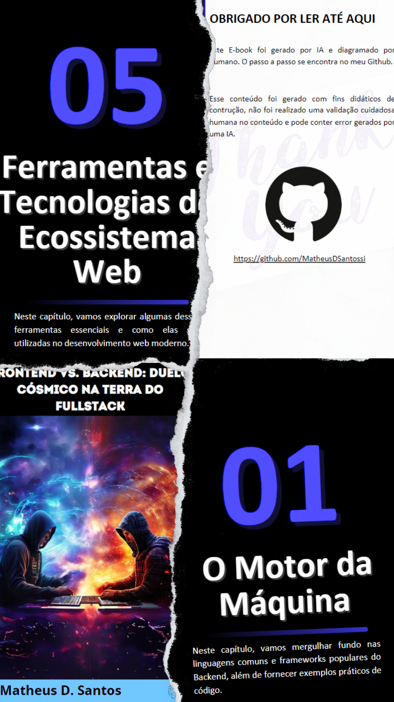

    

-------

# Projeto EBOOK Gerado por I.A.s

 > ℹ️ **NOTE:** Este repositório foi desenvolvido durante o bootcamp do Santander, no qual sou aluno na plataforma [DIO](https://dio.me). **O ebook apresentado não foi revisado**, seu propósito é demonstrar a eficiência das ferramentas de IA e como elas podem tornar o aprendizado e o trabalho mais práticos.

Este projeto tem como objetivo criar um ebook digital utilizando as facilidades proporcionadas pelas ferramentas de IA. Utilizei como base o repositório Git do professor [Felipe Aguiar](https://github.com/felipeAguiarCode).Todos os prompts
seguem abaixo.

<a href="https://github.com/MatheusDSantossi/prompts-recipe-to-create-a-ebook/blob/main/output/ebook%20-%20css%20jedi%20output.pdf" title="View PDF now"> 📕Clique aqui para ler</a>

## 💻 Tecnologias utilizadas no projeto

- [ChatGPT](https://chat.openai.com/)
- [Playground AI](https://playground.com/)
- [Canva](https://www.canva.com/)

## 🧠 Prompts

### ChatGPT

|   Ação   | prompt                                                                                                                                                                                                                                                                         |
| :------: | ------------------------------------------------------------------------------------------------------------------------------------------------------------------------------------------------------------------------------------------------------------------------------ |
|  título  | crie um título de um ebook sobre o tema de Fullstack, Backend, Frontend e suas diferenças do nicho de programação e o subnicho é de linguagens, o título deve ser épico e curto, e tenha uma temática mais nerd, me liste 5 variações do título                                                        |
| conteúdo | faça um texto para ebook, com foco em backend, frontend e fullsatck, listando as principais diferenças entre eles com exemplos em código e linguagens.

**{REGRAS}**
> Explique sempre de uma maneira simples

> Deixe o texto enxuto

> Sempre traga exemplos e código em contextos reais

> Sempre deixe um título sugestivo por tópico |

### 🛝Playground AI

|  Ação  | prompt                                                                                 |
| :----: | -------------------------------------------------------------------------------------- |
| capa | Two developers engage in a cosmic battle—one hailing from the realm of Frontend and the other from the dominion of Backend. Their clash transcends mere code, involving the intricate dance of technologies and the fusion of their skills. At the heart of this cosmic confrontation lies the enigmatic force known as Fullstack—a synthesis of their individual prowess. As they navigate this celestial arena, lines of code intertwine like constellations, each one a testament to their expertise and determination

### Observação: Este prompt foi melhorado, usei um como exemplo e pedi para o Chat GPT melhorar ele

## ✨ Features

- Conteúdo gerado via ChatGPT
- Imagens geradas via Playground AI

## 📚 Materiais

- Imagens utilizadas em `assets`
- ebook gerado durante as aulas em `output`

## 🛠️ Instruções de execução

Utilize os prompts acima nas ferramentas sugeridas para gerar o material base e utilize uma ferramenta de edição de documentos como power point, libreoffice , indesign para diagramação. O template do ebook utilizado pode ser feito uma cópia através do link [Ebook](https://www.canva.com/design/DAGES6ED6Wk/ndFcChWc9SiFcRngzguzRw/edit?utm_content=DAGES6ED6Wk&utm_campaign=designshare&utm_medium=link2&utm_source=sharebutton)

## 👨‍💻 Expert

    
    
&nbsp&nbsp&nbspMatheus D. Santos 
    &nbsp&nbsp&nbsp
    <a href="https://github.com/MatheusDSantossi">
    GitHub</a>&nbsp;|&nbsp;
    <a href="https://www.linkedin.com/in/matheussantossi/">LinkedIn</a>
&nbsp;|&nbsp;
  

  

---

Escrito e incrementado com muito carinho por [Matheus D. Santos](https://github.com/MatheusDSantossi)